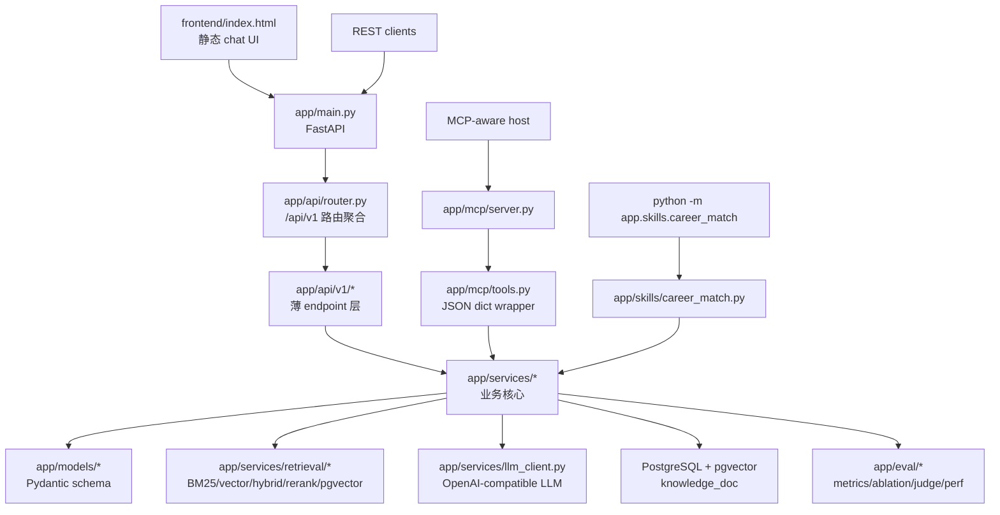
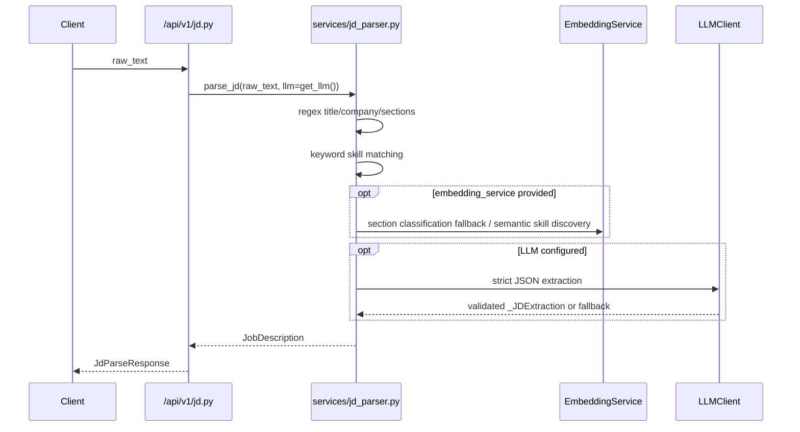
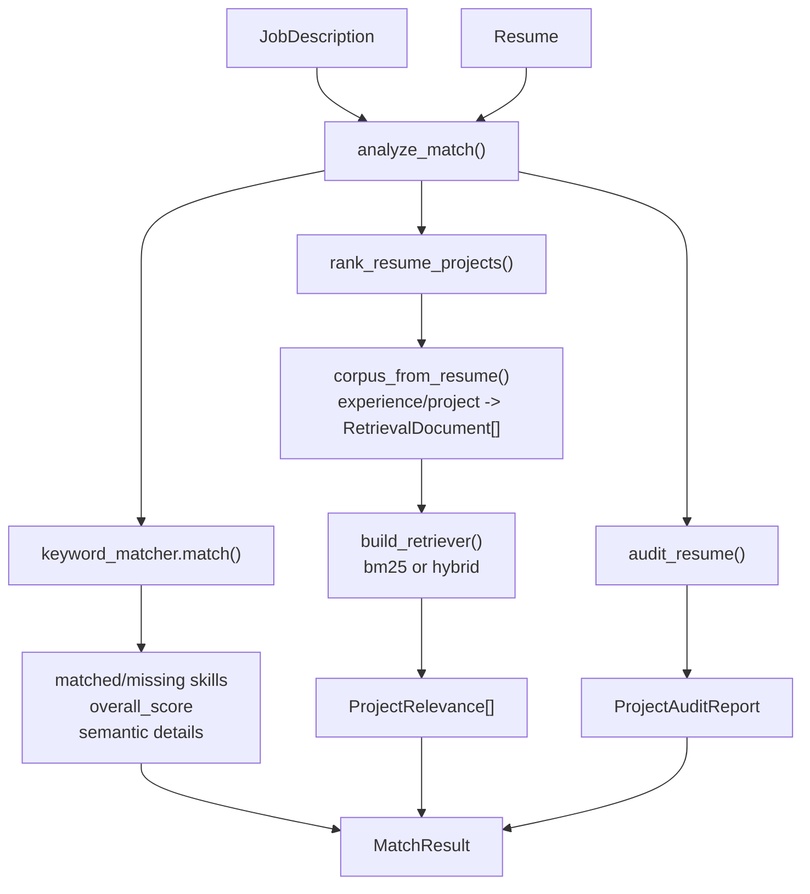
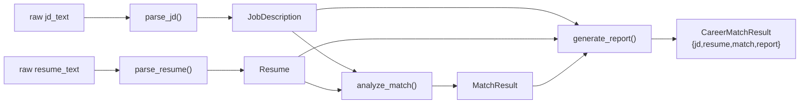
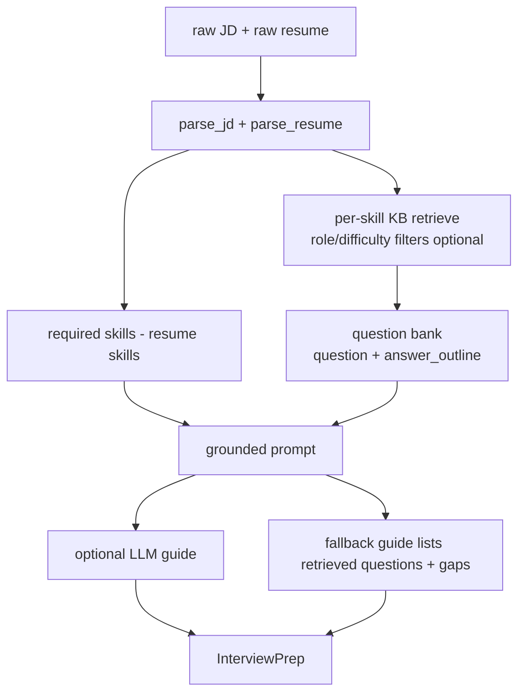
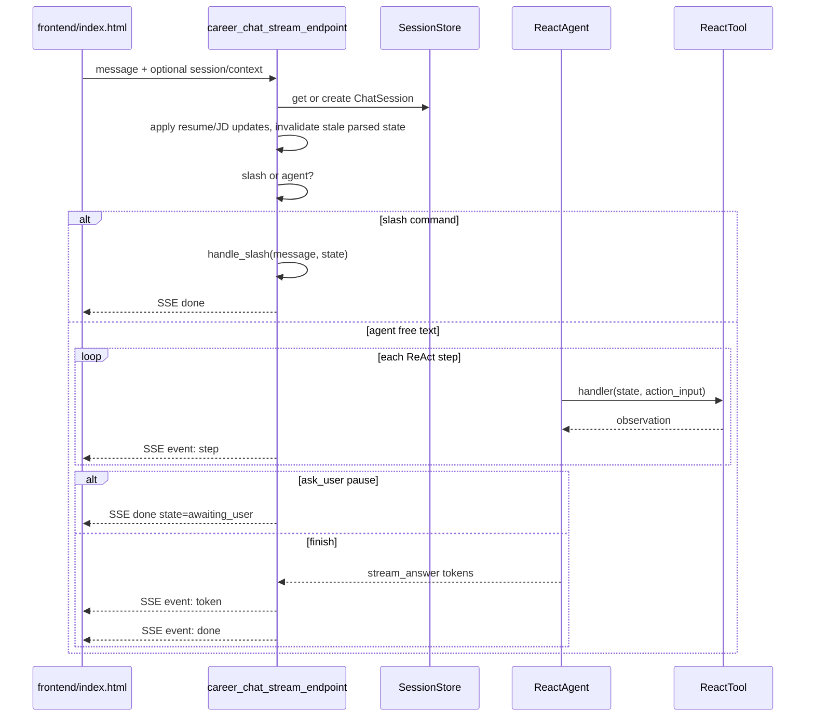

# CareerAgent 项目架构与数据流速读

> 代码 review 日期：2026-06-09  
> 目标：帮助你在短时间内理解这个项目的分层架构、核心对象、内部数据传输、关键链路和扩展入口。  
> 注：修订本文时请同步更新上面的 review 日期。

## 目录

- 0. 一句话总览
- 1. 分层架构地图 — 1.1 功能模块速查
- 2. 运行时组件 — 2.1 EmbeddingService、2.2 依赖注入与 lazy singleton
- 3. 核心数据对象
- 4. API 入口总表
- 5. JD/Resume parse
- 6. JD-resume match — 6.1 技能分数、6.2 项目排序、6.3 风险审计
- 7. report generation
- 8. end-to-end career match
- 9. 检索系统 — 9.1 数据单元、9.2 四种 retriever、9.3 pgvector
- 10. RAG interview prep
- 11. ReAct agent 和 chat — 11.1 ReactState、11.2 /career/ask、11.3 /career/chat/stream、11.4 multi-JD 比较
- 12. MCP 和 CLI — 12.1 MCP、12.2 CLI skill
- 13. LLM 使用与 fallback
- 14. 数据库和知识库
- 15. 评估与测试 — 15.1 检索评估、15.2 LLM judge、15.3 测试布局、15.4 延迟与成本
- 16. 前端数据流
- 17. 常见修改入口
- 18. 重要边界和当前非目标
- 19. 推荐读代码顺序
- 20. 最短 mental model

## 0. 一句话总览

CareerAgent 是一个以 FastAPI 为主入口的 agentic RAG 后端：它接收 JD 和简历文本，通过规则解析、embedding、BM25/向量/混合检索、可选 LLM 增强、ReAct agent、MCP 工具和评估模块，产出岗位匹配分数、技能缺口、相关经历排序、简历真实性风险、面试准备材料和报告。

最重要的设计原则是：

- 确定性核心负责分数、排序、风险和结构化结果。
- LLM 只做可选增强：结构化抽取、建议、报告叙述、agent 决策。
- LLM 失败、未配置或返回非法 JSON 时，系统回退到规则/模板结果。
- REST API、前端 chat、MCP server、CLI skill 都复用同一套 service 层，不各写一套业务逻辑。

## 1. 分层架构地图



核心目录：

| 路径 | 角色 | 你读代码时应关注什么 |
| --- | --- | --- |
| `app/main.py` | FastAPI 应用入口 | CORS、异常处理、`/api/v1` 挂载、`/ui` 静态前端 |
| `app/api/v1/*` | HTTP endpoint | 输入输出模型、service 调用顺序、哪些路径要求 LLM |
| `app/models/*` | Pydantic 数据契约 | JD、简历、匹配、报告、审计、错误 envelope |
| `app/services/*` | 业务核心 | 解析、匹配、检索、LLM fallback、报告、RAG、agent |
| `app/services/retrieval/*` | 检索抽象与实现 | `Retriever.search(query, k)` 统一接口 |
| `app/services/agent/*` | ReAct agent | `ReactState` 工作内存、tool 调用、SSE trace |
| `app/db/connection.py` | pgvector schema | `knowledge_doc` 表、HNSW/vector index、metadata GIN |
| `scripts/ingest_kb.py` | KB 入库脚本 | JSON KB -> embedding -> pgvector upsert |
| `app/mcp/*` | MCP 暴露层 | 把核心能力包装成 MCP tools |
| `app/skills/career_match.py` | 一键 pipeline/CLI | raw JD + raw resume -> 完整结果 |
| `app/eval/*` | 评估工具 | retrieval metrics、ablation、LLM judge、latency |
| `tests/*` | 回归测试 | API、services、retrieval、agent、MCP、eval、DB seam |

### 1.1 功能模块 → 定义与实现 速查

每个功能链路的"定义与实现"文件在对应章节开头都有标注，这里先汇总成一张索引表（列出的章节即下文详述位置）：

| 功能模块 | 章节 | 定义与实现 |
| --- | --- | --- |
| JD/Resume 解析 | §5 | `app/services/jd_parser.py`、`resume_parser.py`；API `app/api/v1/jd.py`、`resume.py`；模型 `app/models/jd.py`、`resume.py` |
| JD-resume 匹配 | §6 | `app/services/match_pipeline.py`、`keyword_matcher.py`、`vector_matcher.py`、`project_auditor.py`；API `app/api/v1/match.py` |
| 报告生成 | §7 | `app/services/report_generator.py`；API `app/api/v1/match.py`（`/match/report`） |
| 端到端 career match | §8 | `app/skills/career_match.py`；API `app/api/v1/career.py`（`/career-match`） |
| 检索系统 | §9 | `app/services/retrieval/*`（接口 `base.py`、四种 retriever、工厂 `factory.py`、`pgvector_retriever.py`） |
| RAG 面试准备 | §10 | `app/services/interview_prep.py`、`retrieval/pgvector_retriever.py`；API `app/api/v1/interview.py` |
| ReAct agent & chat | §11 | `app/services/agent/*`；API `app/api/v1/career.py`（`/career/ask`、`/career/chat/stream`） |
| MCP | §12.1 | `app/mcp/server.py`、`tools.py`、`client.py` |
| CLI skill | §12.2 | `app/skills/career_match.py`；`.claude/skills/career-match/SKILL.md` |
| LLM 封装 & fallback | §13 | `app/services/llm_client.py`、`llm_support.py`、`usage.py` |
| 数据库 & 知识库 | §14 | `app/db/connection.py`、`app/services/knowledge.py`、`scripts/ingest_kb.py`、`data/knowledge/` |
| 评估 & 测试 | §15 | `app/eval/*`、`tests/*` |
| 语义 embedding & 依赖注入 | §2.1–2.2 | `app/services/embedding.py`；`app/api/deps.py`（lru_cache 单例） |
| 前端 | §16 | `frontend/index.html`（由 `app/main.py` 挂到 `/ui/`） |
| 延迟与成本 | §15.4 | `app/eval/perf.py`、`app/services/usage.py` |

## 2. 运行时组件

| 组件 | 位置 | 功能 |
| --- | --- | --- |
| Backend | `app/Dockerfile`, `docker-compose.yml` | Python 3.11 + FastAPI + sentence-transformers + OpenAI SDK |
| Database | `pgvector/pgvector:pg16` | 保存 interview KB 的文本、metadata 和 embedding |
| Static UI | `frontend/index.html` | 简历/JD 输入、slash command、SSE chat 展示 |
| Config | `app/core/config.py`, `.env` | 模型名、设备、DB URL、LLM key/model/base URL |

关键配置项：

| 配置 | 默认值 | 用途 |
| --- | --- | --- |
| `DATABASE_URL` | `postgresql://career:career@db:5432/career` | pgvector KB |
| `EMBEDDING_MODEL_NAME` | `all-MiniLM-L6-v2` | 384 维 embedding |
| `RERANKER_MODEL_NAME` | `cross-encoder/ms-marco-MiniLM-L-6-v2` | cross-encoder rerank |
| `LLM_API_KEY` / `LLM_MODEL` / `LLM_BASE_URL` | 未配置 | OpenAI-compatible LLM |
| `CORS_ORIGINS` | `["*"]` | 前端跨域 |

### 2.1 EmbeddingService（语义地基）

`app/services/embedding.py` 是所有向量/语义能力的底座——技能语义匹配、`VectorRetriever`、`PgVectorRetriever`、cross-encoder 之前的召回都依赖它。

| 方法 | 作用 |
| --- | --- |
| `encode(texts)` | 单条或批量文本 → `np.ndarray (n, 384)` |
| `similarity(a, b)` | 两段文本的余弦相似度 |
| `batch_similarity(query, candidates)` | query 对一组候选的余弦相似度列表（归一化后点积） |

- 模型：`all-MiniLM-L6-v2`，384 维（与 `knowledge_doc.embedding vector(384)` 对齐）。
- lazy 的边界要分清：`SentenceTransformer` 在 `EmbeddingService.__init__` 里**即时加载**（不是按方法懒加载）；真正"懒"的是 `deps.get_embedding_service()` 的进程级单例——首次调用才构造一次，构造失败回退 `None`，让上层走"无 embedding"的降级路径。

### 2.2 依赖注入与 lazy singleton（deps.py）

`app/api/deps.py` 用 `@lru_cache(maxsize=1)` 把几个"贵"的对象做成进程级单例，endpoint 统一从这里取，不各自 `new`：

| 依赖 | 行为 |
| --- | --- |
| `get_embedding_service()` | 构造一次 `EmbeddingService`；失败回退 `None`（触发无 embedding 降级） |
| `get_llm()` | 构造一次 `LLMClient`；未配置 key/model 时走确定性 fallback |
| `get_session_store()` | 进程内 `SessionStore`（重启清空，prototype 边界） |
| `get_kb_retriever()` | `PgVectorRetriever` 外包一层 `RerankingRetriever(candidate_pool=30)` |

好处：构造点集中、测试可注入替身、离线测试不触网也不加载真模型。

## 3. 核心数据对象

这些对象是理解内部数据传输的主线。

| 对象 | 定义文件 | 主要字段 | 来源 | 去向 |
| --- | --- | --- | --- | --- |
| `JobDescription` | `app/models/jd.py` | `raw_text`, `title`, `company`, `skills`, `responsibilities`, `nice_to_haves` | `parse_jd()` | match、retrieval query、report、interview prep |
| `Resume` | `app/models/resume.py` | `raw_text`, `skills`, `projects`, `education`, `experience` | `parse_resume()` | match、audit、retrieval corpus、report |
| `MatchResult` | `app/models/match.py` | skills、scores、semantic matches、experience matches、project relevance、audit | `analyze_match()` 或 `keyword_matcher.match()` | report、agent advice、API response |
| `ProjectRelevance` | `app/models/match.py` | `doc_id`, `source_type`, `label`, `score`, `normalized_score` | `rank_resume_projects()` | match result、report、agent observation |
| `ProjectAuditReport` | `app/models/audit.py` | `findings`, `risk_score`, `summary`, `advice` | `audit_resume()` | report、audit endpoint、agent |
| `MatchReport` | `app/models/match.py` | score、rating、skill summary、gap analysis、recommendations、`full_report` | `generate_report()` | `/match/report`, `/career-match`, CLI |
| `RetrievalDocument` | `app/services/retrieval/base.py` | stable `id`, `text`, `source_type`, `source_index`, `metadata` | resume corpus 或 KB loader | retriever input/provenance |
| `RetrievalResult` | `app/services/retrieval/base.py` | integer/DB `doc_id`, `text`, `score`, `metadata` | retriever output | ranking、RAG、eval |
| `ReactState` | `app/services/agent/schemas.py` | raw text、parsed JD/resume、match/report/interview、multi-JD comparison、conversation、deps | chat/ask endpoint 初始化 | ReAct tools 共享工作内存 |
| `ReactStep` | `app/services/agent/schemas.py` | `thought`, `action`, `action_input`, `observation` | ReAct loop | API trace、SSE step、scratchpad |

注意两个 `doc_id` 概念：

| 场景 | `doc_id` 含义 |
| --- | --- |
| in-memory retriever | `RetrievalResult.doc_id` 是 corpus list 的整数 index，需要映射回 `docs[doc_id]` |
| resume provenance | `RetrievalDocument.id` 是稳定字符串，如 `exp:0`, `proj:1` |
| pgvector retriever | `RetrievalResult.doc_id` 是数据库 `knowledge_doc.id` integer |

## 4. API 入口总表

所有业务 API 都挂在 `/api/v1` 下，入口聚合在 `app/api/router.py`。

| Method | Path | 输入 | 输出 | 核心调用 |
| --- | --- | --- | --- | --- |
| POST | `/jd/parse` | raw JD text | `JobDescription` | `parse_jd()` |
| POST | `/resume/parse` | raw resume text | `Resume` | `parse_resume()` |
| POST | `/match` | parsed JD + parsed Resume | `MatchResult` | `analyze_match()` |
| POST | `/match/report` | parsed JD + parsed Resume | `MatchReport` | `analyze_match()` -> `generate_report()` |
| POST | `/audit` | parsed Resume | `ProjectAuditReport` | `audit_resume()` |
| POST | `/career-match` | raw JD + raw resume | `CareerMatchResult` | `run_career_match()` |
| POST | `/career/ask` | question + resume + one/many JD | answer + ReAct steps | `ReactAgent.run()` |
| POST | `/career/chat/stream` | chat turn + session/context | SSE step/token/done | slash 或 `ReactAgent.iter_run()` |
| POST | `/interview-prep` | raw JD + raw resume + filters | `InterviewPrep` | parse -> KB retrieve -> guide |

成功响应基本是：

```json
{"status": "success", "data": {...}}
```

错误响应由 `app/api/errors.py` 统一成：

```json
{"status": "error", "error": {"type": "...", "message": "...", "detail": ...}}
```

## 5. 核心链路 1：JD/Resume parse

> **定义与实现：** 解析逻辑 `app/services/jd_parser.py`（`parse_jd()`）、`app/services/resume_parser.py`（`parse_resume()`）；HTTP 入口 `app/api/v1/jd.py`、`app/api/v1/resume.py`；数据模型 `app/models/jd.py`、`app/models/resume.py`。

### 5.1 JD parse



实际 endpoint 里 `/jd/parse` 只传了 `llm=deps.get_llm()`，没有传 embedding service。所以 HTTP 解析 endpoint 默认走规则 + 可选 LLM；embedding fallback 更多出现在 `/interview-prep`、`/career-match`、agent、CLI skill 等链路。

`parse_jd()` 的内部顺序：

| 步骤 | 逻辑 |
| --- | --- |
| 1 | `_extract_title()` 从前几行/title-like 行识别标题 |
| 2 | `_extract_company()` 用 `at Company` / `Company is hiring` 等模式识别公司 |
| 3 | `_split_sections()` 用 regex 拆 `requirements/responsibilities/nice_to_have/about` |
| 4 | `_match_skills()` 根据 `TECH_SKILLS` 和 `SKILL_ALIASES` 提取技能 |
| 5 | 如果有 embedding，`_classify_sections()` 和 `_discover_semantic_skills()` 补充召回 |
| 6 | `_extract_bullet_items()` 提取 responsibilities/nice-to-haves |
| 7 | 如果有 LLM，`generate_model()` 让 LLM 结构化抽取；失败回退规则结果 |

### 5.2 Resume parse

`parse_resume()` 类似，但输出 `Resume`：

| 步骤 | 逻辑 |
| --- | --- |
| 1 | `_split_sections()` 拆 `experience/education/skills/projects/certifications` |
| 2 | `_match_skills()` 从 skills+preamble 抽技术栈 |
| 3 | embedding fallback 可做 section classification 和 semantic skill discovery |
| 4 | `_parse_experience_entries()` 抽 `ResumeExperience` |
| 5 | `_parse_education_entries()` 抽 `ResumeEducation` |
| 6 | `_parse_project_entries()` 抽 `ResumeProject` 和 technologies |
| 7 | LLM configured 时用 `_ResumeExtraction` schema 校验，失败回退 |

## 6. 核心链路 2：JD-resume match

> **定义与实现：** 编排 `app/services/match_pipeline.py`（`analyze_match()` / `rank_resume_projects()` / `build_jd_query()`）；技能打分 `app/services/keyword_matcher.py`（`match()`）、`app/services/vector_matcher.py`；风险审计 `app/services/project_auditor.py`（`audit_resume()`）；HTTP 入口 `app/api/v1/match.py`；模型 `app/models/match.py`。

`/match`、slash `/match`、agent `match` tool、CLI skill 都围绕这条链路。



`analyze_match()` 在 `app/services/match_pipeline.py`，它做三件事：

| 阶段 | 函数 | 输出 |
| --- | --- | --- |
| 技能/语义打分 | `keyword_matcher.match()` | `matched_skills`, `missing_skills`, `overall_score`, semantic/experience match |
| 项目/经历相关性排序 | `rank_resume_projects()` | `project_relevance` |
| 风险审计 | `audit_resume()` | `project_audit` |

### 6.1 技能匹配和分数

`keyword_matcher.match()` 的数据流：

```text
jd.skills + resume.skills
  -> exact overlap
  -> missing skills
  -> search missing skills in resume.raw_text
  -> optional VectorMatcher semantic skill match
  -> optional responsibility-to-experience match
  -> optional document-level semantic similarity
  -> weighted overall_score
```

分数权重：

| 模式 | 权重 |
| --- | --- |
| 有 embedding 且有 experience signal | skill 0.75 + experience 0.15 + doc semantic 0.10 |
| 有 embedding 但无 experience signal | skill 0.85 + doc semantic 0.15 |
| 无 embedding | skill coverage * 0.90 |

Vector 阈值：

| 匹配 | 默认阈值 |
| --- | --- |
| skill-to-skill | `0.55` |
| responsibility-to-experience | `0.50` |

### 6.2 project relevance 排序

`rank_resume_projects()` 的数据变形：

```text
Resume.experience[] + Resume.projects[]
  -> corpus_from_resume()
  -> RetrievalDocument[]
  -> document_texts()
  -> build_retriever(method, corpus)
  -> search(build_jd_query(jd), k=len(docs))
  -> RetrievalResult[]
  -> map doc_id back to docs[doc_id]
  -> ProjectRelevance[]
```

`build_jd_query(jd)` 优先组合 `jd.skills + jd.responsibilities`；如果结构化字段为空，回退到 `jd.raw_text`。

检索方法选择：

| 条件 | method |
| --- | --- |
| 有 embedding service | `hybrid` |
| 无 embedding service | `bm25` |
| eval/ablation 可选 | `bm25`, `vector`, `hybrid`, `hybrid+rerank` |

### 6.3 audit 风险审计

`audit_resume()` 是规则优先，不让 LLM 决定风险分数。

| finding category | 触发逻辑 |
| --- | --- |
| `unsupported_skill` | skill 出现在技能列表，但 experience/project 证据中没有出现 |
| `vague_experience` | highlight 有 impact marker，但没有数字/百分比等量化证据 |
| `unsupported_project_claim` | project 列出高级技术，但描述过短或没有支撑 |

风险分数：

```text
severity weighted sum / (high severity weight * resume unit count)
```

LLM 只在 `findings` 已经确定后生成 `advice`，不会改变 `risk_score`。

## 7. 核心链路 3：report generation

> **定义与实现：** `app/services/report_generator.py`（`generate_report()`）；HTTP 入口 `app/api/v1/match.py`（`/match/report`）；模型 `app/models/match.py`（`MatchReport`）。

`generate_report(jd, resume, result, llm)` 产出 `MatchReport`。

```text
JobDescription + Resume + MatchResult
  -> deterministic structured fields
  -> deterministic markdown template
  -> optional LLM narrative grounded on structured fields
  -> fallback to template if LLM unavailable/fails
```

稳定结构化字段包括：

| 字段 | 来源 |
| --- | --- |
| `overall_score` | `MatchResult.overall_score` |
| `overall_rating` | `_rating(score)` |
| `skill_summary` | matched/missing/semantic count |
| `skill_gap_analysis` | missing skills |
| `recommendations` | score bucket + missing skills |
| `project_audit` | `MatchResult.project_audit` |
| `full_report` | template 或 LLM grounded markdown |

LLM prompt 只接收结构化 report JSON，并被要求不能发明事实。即使 LLM 出错，用户仍会拿到模板报告。

## 8. 核心链路 4：end-to-end career match

> **定义与实现：** `app/skills/career_match.py`（`run_career_match()` + CLI `main()`）；HTTP 入口 `app/api/v1/career.py`（`/career-match`）。

`app/skills/career_match.py` 是最干净的一键入口，也被 `/career-match` 复用。



这条链路适合当作项目主功能的“黄金路径”来读：

1. `run_career_match()` 接 raw text。
2. 解析 JD 和简历。
3. 调 `analyze_match()` 得到分数、相关经历、审计。
4. 调 `generate_report()` 得到结构化报告和 markdown。
5. 返回 `CareerMatchResult`。

## 9. 检索系统

> **定义与实现：** `app/services/retrieval/`——接口与 corpus 工具 `base.py`（`Retriever` 协议、`corpus_from_resume()` / `document_texts()`）、`bm25_retriever.py`、`vector_retriever.py`、`hybrid_retriever.py`、`reranker.py`、`pgvector_retriever.py`、工厂 `factory.py`（`build_retriever()`）。

所有检索后端都服从同一个接口：

```python
search(query: str, k: int = 10) -> list[RetrievalResult]
```

### 9.1 RetrievalDocument 和 RetrievalResult

`RetrievalDocument` 是带 provenance 的原始文档单元：

```text
ResumeExperience -> RetrievalDocument(id="exp:0", text="...", metadata={title, company})
ResumeProject    -> RetrievalDocument(id="proj:1", text="...", metadata={name, technologies})
KB entry          -> RetrievalDocument(id="python:q1", text="...", metadata={skill, role, difficulty, answer_outline})
```

`RetrievalResult` 是一次检索返回的“评分结果”：

```text
doc_id: retriever corpus index or DB row id
text: matched document text
score: backend-specific score
metadata: KB metadata or empty dict
```

### 9.2 四种本地 retriever

| Retriever | 文件 | 作用 | 特点 |
| --- | --- | --- | --- |
| `BM25Retriever` | `bm25_retriever.py` | lexical recall | 精确技术词、无 embedding 也可跑 |
| `VectorRetriever` | `vector_retriever.py` | semantic recall | 语义相近但词不同也能匹配 |
| `HybridRetriever` | `hybrid_retriever.py` | BM25 + vector fusion | 默认 RRF，也支持 weighted fusion |
| `RerankingRetriever` | `reranker.py` | cheap recall + cross-encoder rerank | 更准但更慢，适合小候选池 |

`build_retriever()` 是统一工厂：

```text
"bm25" -> BM25Retriever
"vector" -> VectorRetriever, requires embedding_service
"hybrid" -> HybridRetriever, requires embedding_service
"hybrid+rerank" -> HybridRetriever + RerankingRetriever
```

### 9.3 pgvector KB retriever

`PgVectorRetriever` 用于 interview KB：

```text
query
  -> embedding_service.encode([query])
  -> SELECT id, text, metadata, 1 - (embedding <=> query_vector) AS score
     FROM knowledge_doc
     WHERE embedding IS NOT NULL AND optional metadata filters
     ORDER BY embedding <=> query_vector
     LIMIT k
  -> RetrievalResult[]
```

metadata filter：

| filter shape | SQL |
| --- | --- |
| scalar | `metadata ->> key = value` |
| list/tuple | `metadata -> key ?| values` |

`deps.get_kb_retriever()` 实际返回：

```text
PgVectorRetriever -> RerankingRetriever(candidate_pool=30, Reranker())
```

所以 KB 线上路径是 pgvector recall + cross-encoder rerank。

## 10. RAG interview prep

> **定义与实现：** `app/services/interview_prep.py`（`generate_interview_prep()`）；KB 检索 `app/services/retrieval/pgvector_retriever.py`（经 `app/api/deps.py` 的 `get_kb_retriever()` 包成 rerank）；HTTP 入口 `app/api/v1/interview.py`。

`/interview-prep` 是项目里最典型的 RAG 链路。



`generate_interview_prep()` 的重要点：

| 设计 | 原因 |
| --- | --- |
| 按 skill 分别检索，每个 skill 取 `per_skill=2` | 避免一个强势 skill 吃掉所有 top-k |
| `role` / `difficulty` 可选过滤 | 让 KB 结果更贴目标岗位和难度 |
| `answer_outline` 放进 prompt | 让 LLM guide 有可用答案骨架 |
| 无 LLM 时回退到问题列表 + gaps | RAG 能降级，不直接失败 |

## 11. ReAct agent 和 chat 数据流

Agent 文件集中在 `app/services/agent/*`，两个 HTTP 入口都在 `app/api/v1/career.py`（`/career/ask` 与 `/career/chat/stream`）。

| 文件 | 角色 |
| --- | --- |
| `schemas.py` | `ReactState`, `ReactTool`, `ReactStep`, `ReactResult`, `ReactDecision` |
| `react_controller.py` | ReAct loop，LLM 决策、tool 调用、finish/ask_user 控制 |
| `tools.py` | 默认工具，封装 parse/match/rank/audit/report/KB/prep/advice/rewrite/compare |
| `slash.py` | deterministic slash command |
| `sessions.py` | in-memory chat session、history、summary、pending ask_user state |
| `trace.py` | scratchpad 渲染和 step 序列化 |

**Step budget：** ReAct loop 有步数上限——`build_default_agent` 默认 `max_steps=8`，而 `/career/ask`、`/career/chat/stream` 的请求体允许覆盖 `max_steps`（默认 `12`，范围 1–20）。跑满预算仍未 `finish` 时，循环停止并以 `completed=False` 返回当前结果，避免无限 loop。

### 11.1 ReactState 是工作内存

Agent 不是把大对象在每一步 prompt 里来回传，而是把对象存在 `ReactState`：

```text
ReactState
  jd_text / resume_text      raw inputs
  jd / resume                parsed objects
  match / report / interview computed outputs
  jd_inputs / comparison     multi-JD path
  conversation               rolling chat context
  embedding_service          dependency
  kb_retriever               dependency
  llm                        dependency
```

Tool 只返回短 observation，例如：

```text
"Parsed JD: title='ML Engineer', 8 skills, 4 responsibilities."
"Match score 0.72: 5 matched, 3 missing skills (kubernetes, airflow, spark)."
```

这样可以减少 token，也让 scratchpad 可读。

### 11.2 `/career/ask` 一次性 agent 问答

```text
CareerAskRequest
  -> validate jd_text or jds exists
  -> require LLM configured
  -> build ReactState(raw JD/resume, deps)
  -> build_default_agent()
  -> agent.run(question, state)
  -> ReactResult.answer + steps
```

如果没有配置 LLM，直接返回 503，因为 agent 决策本身需要 LLM。

**和 `/career/chat/stream` 的关系（重要）：** 两者跑的是同一个 agent（`build_default_agent()`）和同一份 `ReactState`，区别只在"传输形态"和"是否带会话"：

| 维度 | `/career/ask` | `/career/chat/stream` |
| --- | --- | --- |
| 交互 | 一次性单轮问答 | 多轮对话 |
| 传输 | 同步返回完整 JSON（`{answer, completed, steps}`） | Server-Sent Events，step/token 流式 |
| 会话状态 | 无，每次重新 seed `ReactState` | 进程内 `SessionStore` 持久化 parsed JD/resume/match + history |
| slash command | 不支持 | 支持（`/match` 等确定性 shortcut） |
| `ask_user` 暂停/恢复 | 不支持 | 支持（`awaiting_user`） |
| 当前调用方 | REST/脚本/测试；前端 UI **不**调用 | 前端 chat UI |

功能上 `/career/ask` 是 `/career/chat/stream` 的严格子集。**保留它的理由**是它提供一个不需要解析 SSE、不需要管理 `session_id` 的同步一次性 JSON 接口——更适合程序化调用、一次性 `curl` 和外部集成。流式多轮入口和同步单轮入口共享同一核心、只是暴露形态不同，本身就是一个可解释的传输层分层（而不是冗余）。

### 11.3 `/career/chat/stream` 多轮 SSE

前端调用 `/api/v1/career/chat/stream`，后端返回 Server-Sent Events。



SSE event 类型：

| event | data | 何时出现 |
| --- | --- | --- |
| `step` | `ReactStep` dict | 每完成一个 ReAct tool/action |
| `token` | `{"text": "..."}` | final answer token stream |
| `done` | session id、reply、state、history | 每轮结束 |

Session 行为：

| 状态 | 说明 |
| --- | --- |
| `session_id` | 首轮为空，服务端创建并返回 |
| `history` | 保存 visible user/assistant messages |
| `summary` | 旧消息超过 `RECENT_WINDOW=6` 后折叠进 rolling summary |
| `pending_question` | agent 调 `ask_user` 时暂停 |
| `pending_steps` | 下轮用户回答后用于恢复原 ReAct run |

Slash commands：

| command | 逻辑 |
| --- | --- |
| `/match` | ensure parse -> `analyze_match()` |
| `/report` | ensure parse/match -> `generate_report()` |
| `/prep [role] [difficulty]` | ensure parse -> KB RAG prep |
| `/audit` | ensure resume -> `audit_resume()` |
| `/compare` | multiple JD comparison |
| `/help` | command list |

Slash 是确定性的 shortcut，可以无 LLM 工作；自由文本 agent 需要 LLM。

### 11.4 multi-JD 比较流程

当用户问"这几个岗位哪个更适合我"时，agent 走 `compare_jds` → `select_jd` 两步（都在 `app/services/agent/tools.py`）：

```text
compare_jds:
  state.jd_inputs[]（≥2，seed 进来的候选 JD）
    -> 逐个 parse_jd + analyze_match(resume)
    -> state.comparison = JdComparison[]（按 overall_score 倒序）
    -> 返回 "Best fit: <label>" + 各 JD 分数
select_jd(label / index):
    -> 把选中的 JdComparison 提升为 active state.jd / state.match
    -> 之后 rank_projects / advise / rewrite_bullet 等单-JD 工具就针对它工作
```

比较轮数是数据驱动的（候选有几个就比几个），这正是固定 endpoint 表达不了、需要 agent 的地方。该路径依赖 LLM 决策，无 LLM 时不可用。

## 12. MCP 和 CLI skill

### 12.1 MCP

> **定义与实现：** `app/mcp/server.py`（FastMCP 注册）、`app/mcp/tools.py`（dict in/out 包装）、`app/mcp/client.py`（`MCPClient`）。

MCP 层只做 JSON 输入输出包装，不拥有业务逻辑。

```text
MCP host
  -> app/mcp/server.py FastMCP tool
  -> app/mcp/tools.py
  -> reconstruct Pydantic models if needed
  -> services/*
  -> model_dump() / list[dict]
```

暴露的 tools：

| MCP tool | 调用 |
| --- | --- |
| `parse_jd` | `parse_jd_tool(raw_text)` |
| `parse_resume` | `parse_resume_tool(raw_text)` |
| `match_resume` | `match_tool(jd, resume)` |
| `audit_resume` | `audit_tool(resume)` |
| `rank_projects` | `rank_projects_tool(jd, resume)` |

`MCPClient` 是 async context manager，可以启动 `python -m app.mcp.server` 并调用 tools。

### 12.2 CLI skill

> **定义与实现：** `app/skills/career_match.py`（CLI `main()` + `run_career_match()`）；Claude Code skill 清单 `.claude/skills/career-match/SKILL.md`。

`python -m app.skills.career_match --jd JD.txt --resume RESUME.txt`：

```text
read files
  -> try EmbeddingService()
  -> LLMClient() unless --no-llm
  -> run_career_match()
  -> print report.full_report
  -> print audit summary if findings exist
```

这个入口适合做 smoke test 或演示一键能力。

## 13. LLM 使用方式和 fallback 边界

> **定义与实现：** `app/services/llm_client.py`（`LLMClient`）、`app/services/llm_support.py`（`generate_text()` / `generate_model()` / `extract_json()`）、`app/services/usage.py`（token/cost 统计）。

`LLMClient` 是 OpenAI-compatible wrapper：

| 方法 | 作用 |
| --- | --- |
| `is_configured()` | 判断 `api_key` 和 `model` 是否存在 |
| `complete()` | 单次 chat completion |
| `stream()` | token stream |
| `_record_usage()` | 捕获 token usage |
| `_is_deepseek()` | DeepSeek 兼容参数处理 |

`llm_support.py` 是可靠性核心：

| helper | 用途 | fallback |
| --- | --- | --- |
| `generate_text()` | 生成自然语言，如 report/advice/guide | LLM 未配置/异常/空回复 -> fallback string |
| `generate_model()` | 生成 schema JSON，如 JD/resume extraction、judge verdict | parse/validate 失败 -> corrective retry -> fallback model |
| `extract_json()` | 从纯 JSON、fenced block、混杂 prose 中抽 JSON | 失败抛错，外层 fallback |

LLM 参与点：

| 场景 | 文件 | 影响范围 |
| --- | --- | --- |
| JD 抽取 | `jd_parser.py` | 只影响结构化字段；失败回退规则 |
| Resume 抽取 | `resume_parser.py` | 只影响结构化字段；失败回退规则 |
| audit advice | `project_auditor.py` | 只生成建议；不改 finding/score |
| report narrative | `report_generator.py` | 只生成 `full_report`；不改结构化分数 |
| interview guide | `interview_prep.py` | 只生成 guide；无 LLM 时列问题和 gaps |
| ReAct decision/final answer | `agent/react_controller.py` | agent 必需 LLM |
| chat summary | `agent/sessions.py` | 无 LLM 时用截断 transcript fallback |
| LLM judge | `eval/llm_judge.py` | judge 失败返回 unevaluated verdict |

## 14. 数据库和知识库

> **定义与实现：** schema/连接 `app/db/connection.py`；KB 源 `data/knowledge/interview_questions.json`；加载 `app/services/knowledge.py`（`load_kb_documents()`）；入库脚本 `scripts/ingest_kb.py`。

### 14.1 KB source

源文件：

```text
data/knowledge/interview_questions.json
```

每条 KB entry 大致包含：

```json
{
  "id": "python:q1",
  "skill": "python",
  "role": ["backend", "ai_engineer"],
  "difficulty": "mid",
  "type": "question",
  "tags": ["concurrency"],
  "text": "...",
  "answer_outline": "..."
}
```

`load_kb_documents()` 会转成 `RetrievalDocument`，metadata 保留 `skill/type/role/difficulty/tags/answer_outline`。

### 14.2 DB schema

`app/db/connection.py` 定义：

```sql
CREATE TABLE IF NOT EXISTS knowledge_doc (
    id serial PRIMARY KEY,
    doc_id text UNIQUE NOT NULL,
    skill text,
    doc_type text,
    text text NOT NULL,
    metadata jsonb NOT NULL DEFAULT '{}',
    embedding vector(384)
);
```

索引：

| index | 用途 |
| --- | --- |
| `knowledge_doc_metadata_gin` | metadata filter |
| `knowledge_doc_embedding_hnsw` | vector cosine ANN |

### 14.3 Ingestion

```text
python -m scripts.ingest_kb
  -> load_kb_documents()
  -> EmbeddingService().encode([doc.text])
  -> ensure_schema()
  -> upsert knowledge_doc by doc_id
```

## 15. 评估与测试

> **定义与实现：** `app/eval/`——`metrics.py`、`datasets.py`、`runner.py`、`ablation.py`、`llm_judge.py`、`perf.py`；评估 fixtures `tests/fixtures/`；回归测试套件 `tests/`。

### 15.1 Retrieval evaluation

`app/eval/*` 的数据流：

```text
tests/fixtures/retrieval_documents.json
tests/fixtures/relevance_queries.json
  -> load_eval_dataset()
  -> build_retriever(method, document_texts(documents))
  -> evaluate_retriever()
  -> recall@k, MRR, nDCG@k
```

指标：

| metric | 衡量什么 |
| --- | --- |
| `recall_at_k` | top-k 是否召回相关文档 |
| `mrr` | 第一个相关文档排得多靠前 |
| `ndcg_at_k` | 带 graded relevance 的整体排序质量 |

Ablation：

```text
bm25 vs vector vs hybrid vs hybrid+rerank
```

用于证明每个 retrieval stage 是否真的带来收益。

### 15.2 LLM-as-judge

`judge_report()` 用另一个 LLM 对报告做 grounding/coverage/clarity 打分，并列 unsupported claims。它本身也走 `generate_model()`，失败返回 unevaluated，不会炸测试或 pipeline。

### 15.3 测试布局

| 测试目录 | 覆盖范围 |
| --- | --- |
| `tests/api/v1/*` | HTTP endpoint contract |
| `tests/services/*` | parser、matcher、report、audit、LLM support、usage |
| `tests/services/retrieval/*` | BM25/vector/hybrid/rerank/pgvector/factory |
| `tests/services/agent/*` | ReAct loop、tools、slash、sessions、trace |
| `tests/mcp/*` | MCP tool/server/client |
| `tests/eval/*` | metrics、dataset、runner、ablation、judge、perf |
| `tests/db/*` | schema helper seam |
| `tests/skills/*` | end-to-end career match skill |

### 15.4 延迟与成本

| 模块 | 作用 |
| --- | --- |
| `app/eval/perf.py` | `LatencyRecorder.measure()` 计时代码块，`stats()` 汇总成 `p50 / p95 / p99 / mean / max`（`LatencyStats`）——尾延迟比均值更能反映真实体验 |
| `app/services/usage.py` | `TokenUsage`(prompt/completion) + `UsageTracker` 累加 token，`estimate_cost(usage, input_per_mtok, output_per_mtok)` 折算美元 |

`LLMClient` 每次调用把 `response.usage` 记进 `last_usage`，并喂给可选的 `usage_tracker`，所以 token 成本能跨调用透明累计。确定性检索/审计路径是 sub-second，LLM 调用才是延迟主导项。

## 16. 前端数据流

> **定义与实现：** `frontend/index.html`（单文件静态 UI），由 `app/main.py` 用 `StaticFiles` 挂到 `/ui/`。

`frontend/index.html` 是单文件静态 UI，由 FastAPI 挂到 `/ui/`。

前端做的事：

| 模块 | 行为 |
| --- | --- |
| context form | 收集 resume 和 1-3 个 JD |
| `send()` | 组装 `message/session_id/resume_text/jd_text/jds` |
| `fetch("/api/v1/career/chat/stream")` | 发起 SSE 请求 |
| `readSSE()` | 解析 `step/token/done` |
| live assistant bubble | step 时显示 thinking/trace，token 时逐字输出 |
| slash hint | `/match`, `/report`, `/prep`, `/audit`, `/compare`, `/help` 自动提示 |
| markdown renderer | 简单渲染 headings、list、table、bold、code |

前端只保存 `sessionId` 和上次 context hash。真正的 parsed JD/resume/match 保存在后端 `SessionStore`。

## 17. 常见修改入口

| 你想改什么 | 优先看哪里 |
| --- | --- |
| 新增 API endpoint | `app/api/v1/*`, `app/api/router.py`, `app/models/*` |
| 新增字段到 JD/Resume | `app/models/jd.py` 或 `resume.py`，再改 parser、tests、report/agent 需要处 |
| 调整匹配分数 | `app/services/keyword_matcher.py` 权重和 summary |
| 调整项目排序 | `app/services/match_pipeline.py`, `app/services/retrieval/*` |
| 增加检索方法 | 实现 `Retriever.search()`，注册到 `factory.py`，补 eval/test |
| 调整 RAG KB | `data/knowledge/interview_questions.json`, `scripts/ingest_kb.py`, `interview_prep.py` |
| 修改 agent 工具 | `app/services/agent/tools.py` 和对应测试 |
| 修改 slash command | `app/services/agent/slash.py` 和前端 `SLASH` 列表 |
| 支持持久 chat session | 替换 `SessionStore`，考虑 auth/session ownership |
| 加生产观测 | `app/main.py` middleware/logging，service 层 latency/usage tracking |
| 加鉴权/限流 | FastAPI dependencies/middleware，目前项目没有这一层 |
| 改 LLM provider | `app/services/llm_client.py`, `.env`, tests for compatible client |

## 18. 重要边界和当前非目标

项目 README 也提示了这些 prototype 边界，读代码时要带着它们：

| 边界 | 当前状态 |
| --- | --- |
| 持久用户数据 | 没有；chat session 是进程内 dict，重启丢失 |
| 认证授权 | 没有 |
| rate limiting | 没有 |
| 生产级 observability | 没有完整链路 |
| 长任务队列 | 没有；目前同步/stream 处理 |
| KB 持久化 | 有 PostgreSQL + pgvector，但只针对 interview KB |
| 简历/JD 存储 | 没有落库 |
| LLM 必需性 | deterministic pipeline 不必需；agent 必需 |

## 19. 推荐读代码顺序

如果你第一次进项目，按这个顺序读最省脑：

1. `app/models/*`：先掌握数据对象。
2. `app/services/jd_parser.py` 和 `resume_parser.py`：看 raw text 如何变结构化。
3. `app/services/keyword_matcher.py`：看分数怎么来。
4. `app/services/match_pipeline.py`：看 match orchestration 和 project relevance。
5. `app/services/retrieval/base.py` + `factory.py`：看统一检索接口。
6. `app/services/report_generator.py` 和 `project_auditor.py`：看报告和风险。
7. `app/api/v1/career.py`：看一键 pipeline、agent ask、SSE chat。
8. `app/services/agent/*`：看 ReAct 工作内存和工具调用。
9. `app/services/interview_prep.py` + `retrieval/pgvector_retriever.py`：看 RAG。
10. `app/mcp/*`, `app/skills/career_match.py`, `app/eval/*`：看外围暴露和验证。

## 20. 最短 mental model

把整个项目记成这条链就够用了：

```text
raw JD/resume
  -> Pydantic parsed objects
  -> deterministic scoring/ranking/audit
  -> optional retrieval/RAG context
  -> optional LLM extraction/advice/narrative/agent decision
  -> structured API/MCP/CLI/chat response
```

最关键的工程取舍：

- 业务可信数据来自 deterministic services，不直接相信 LLM。
- 检索统一成 `Retriever`，所以 BM25/vector/hybrid/rerank/pgvector 能互换。
- Agent 不重写业务逻辑，只通过 tools 调用已存在 services。
- 前端不保存业务状态，只保存 `sessionId`，服务端 `ReactState` 才是会话工作内存。
- 测试覆盖的是 seam：parser、retriever、agent loop、MCP、eval，而不是只测 HTTP。
